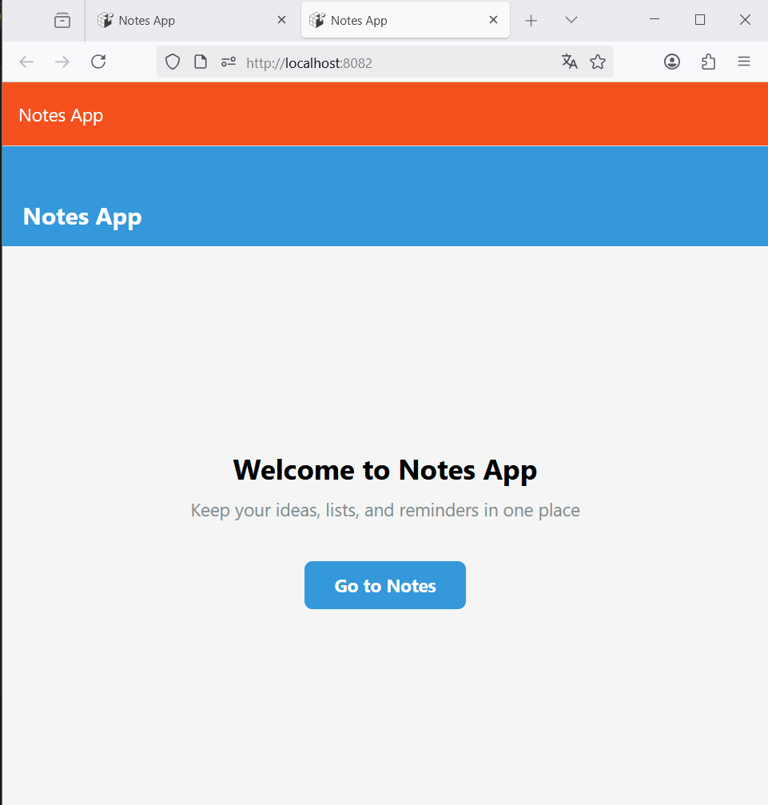
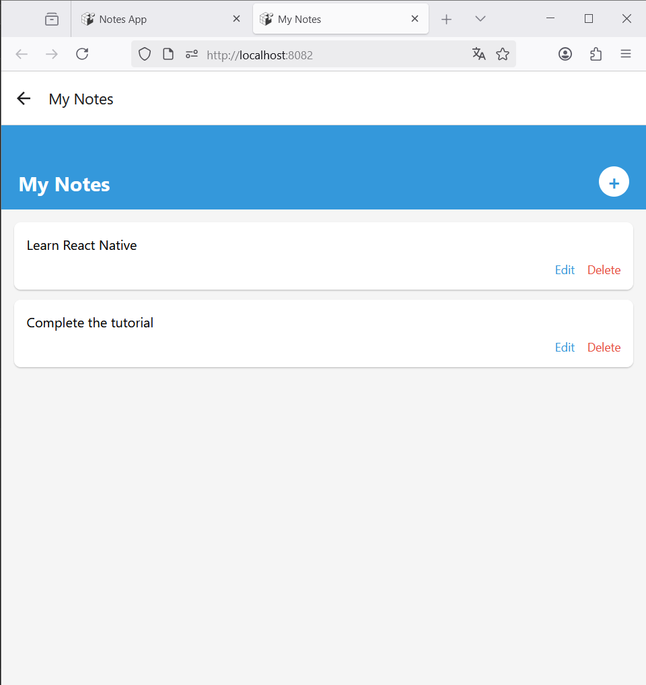
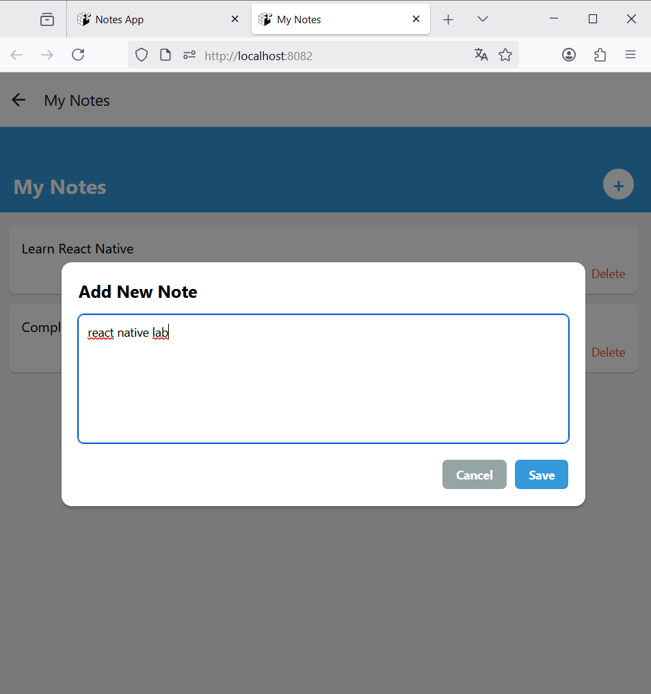
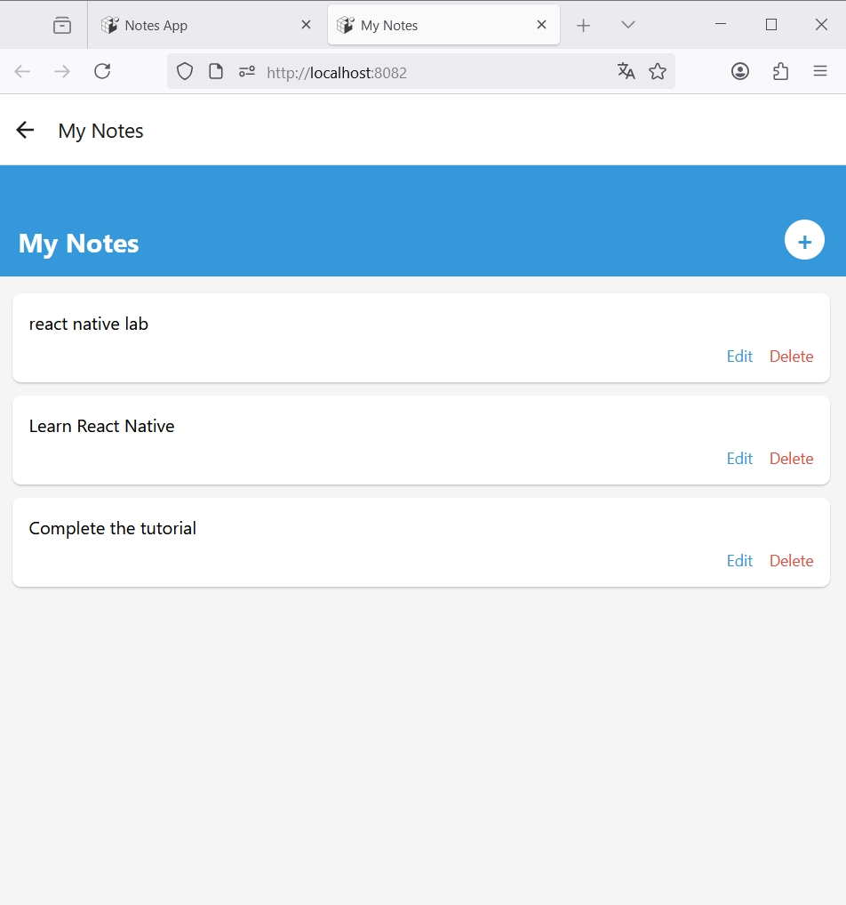

# React Native Lab 1 - Notes App

A simple note-taking application built with **React Native**.  
Allows you to add, edit, and delete notes.

# 1. Commands needed to create the React Native project

## Install Expo CLI
npm install -g expo-cli

## Create the new project
expo init NotesApp

## Navigate to the project directory:
cd NotesApp

## Start the development server:
npx expo start

# Screenshots

### Home Page

### Notes List Page

### Add Note Page

### Notes List page with the new Note 

## Clone the repository
git clone https://github.com/Nour4git/lab1_react_native.git

